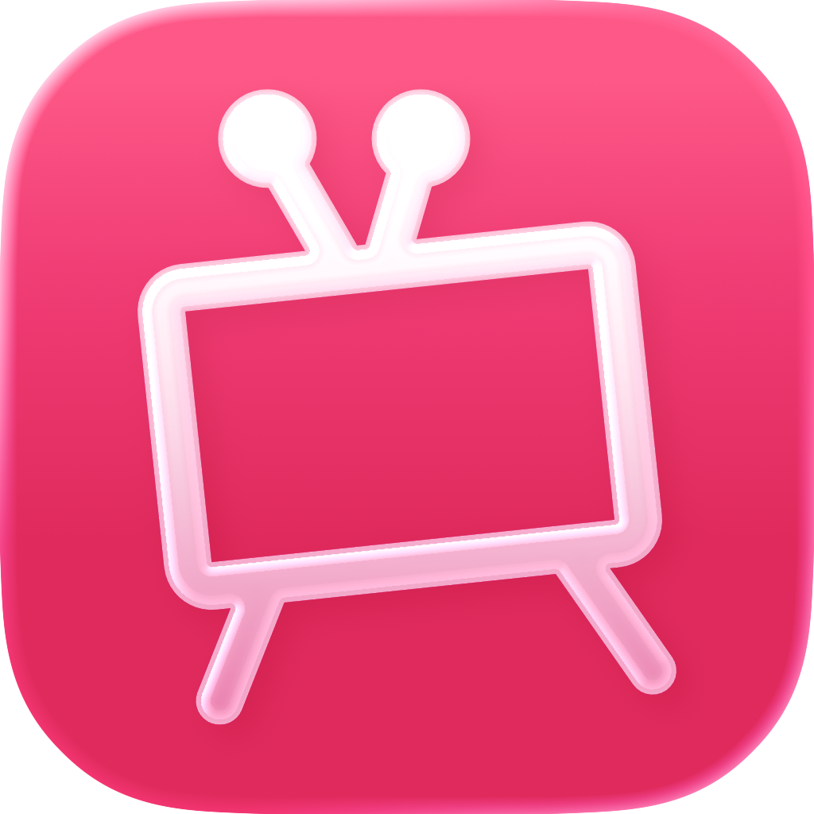

<div align="center">
  

  <h1>Zapp für iOS</h1>

  <p><strong>Das Android-Erlebnis von Zapp, jetzt für iPhone und iPad.</strong></p>

  <p>
    
    
    
    
  </p>
</div>

<br />

> Zapp für iOS ist ein freier, quelloffener Client für die öffentlich-rechtlichen Live-Sender und Mediatheken Deutschlands. Kein Account, kein Tracking, kein Schnickschnack.

## 1. Overview

Zapp für iOS ist ein **Fork der Android-App [Zapp](https://github.com/mediathekview/zapp/)**. Er bringt schnellen Zugriff auf über 30 öffentlich-rechtliche Sender und deren Mediatheken direkt auf iPhone und iPad, ohne Account und ohne Werbung.

> **Achtung:** Die App befindet sich noch in aktiver Entwicklung. Es kann zu Bugs und unerwartetem Verhalten kommen. Feedback und Bug-Reports sind sehr willkommen.

## 2. Features

- **Live TV**: über 30 öffentlich-rechtliche Sender live streamen
- **Schneller Senderwechsel**: nahtlos zwischen Programmen springen
- **Programminfos**: übersichtliche Infos zu laufenden Sendungen
- **Mediatheken-Suche**: komfortabel in allen Mediatheken stöbern
- **Stabile Hintergrundwiedergabe**: Ton läuft weiter, auch wenn die App im Hintergrund ist
- **iPhone & iPad**: volle Unterstützung für beide Gerätetypen
- **Untertitel**: derzeit nicht verfügbar, geplant für ein zukünftiges Update

> **Hinweis:** Einige Sender können im Ausland geoblockt sein.

## 3. Installation

**Aus den GitHub Releases**

Lade die aktuellste unsignierte IPA direkt von der Releases-Seite:

> https://github.com/YONN2222/Zapp-iOS/releases

Da die App unsigniert ist, kannst du sie nicht einfach installieren, sondern brauchst einen Sideloading-Dienst wie [SideStore](https://sidestore.io/), um die IPA auf dein iPhone oder iPad zu laden.

## 4. Usage

1. App öffnen
2. Im Tab **Live** einen Sender auswählen und direkt loslegen
3. Im Tab **Mediathek** nach Sendungen suchen und stöbern
4. Wiedergabe läuft auch stabil im Hintergrund weiter

## 5. Build It Yourself

1. **Repository klonen**
   ```bash
   git clone https://github.com/YONN2222/Zapp-iOS.git
   cd Zapp-iOS
   ```

2. **Projekt in Xcode öffnen**
   ```bash
   open Zapp.xcodeproj
   ```

3. **App bauen**
   ```bash
   xcodebuild -project Zapp.xcodeproj -scheme Zapp -configuration Release
   ```

---

<div align="center">
  <sub>Lizenziert unter <a href="LICENSE">GPLv3</a>.</sub>
</div>
